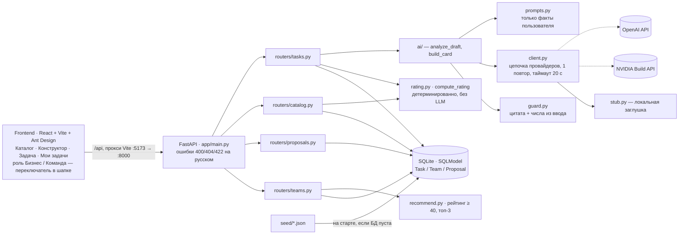

# TaskReady

Веб-приложение, которое помогает представителю бизнеса превратить сырое описание задачи в полноценную карточку, получить объяснимый рейтинг готовности 0–100 и опубликовать задачу в открытом каталоге, где студенческие команды сами выбирают, на что откликнуться.

**Проблема.** Бизнес формулирует задачу в одну строку: «Продажи в будние дни падают, хотим понять почему». Команда не может по такому тексту начать работу: непонятно, какие есть данные, что считать результатом и по каким признакам работу примут. Задача выглядит привлекательно, но не готова к исполнению.

**Решение.** ИИ находит пробелы и задаёт 3–5 вопросов по самым весомым из них, собирает карточку **только из слов пользователя** (каждое поле от ИИ подтверждено дословной цитатой из ввода), а код детерминированно считает рейтинг готовности по формуле кейса и показывает, чего не хватает и сколько баллов это даст.

**Для кого:**
- **бизнес** — видит, что именно мешает задаче быть понятной, и правит её до публикации;
- **студенческие команды** — открытый каталог, отсортированный по готовности, с честной пометкой, какие задачи придётся уточнять у заказчика;
- **организатор программы** — задачи в каталоге сопоставимы между собой по единой шкале.

Кейс AI Sana «Рейтинг качества бизнес-задач и открытый выбор команд», хакатон HackAlem AI.

---

## 1. Что реализовано

Обязательные модули кейса:

- ✅ **Конструктор задачи** — черновик (20–3000 символов) + отрасль → ИИ извлекает уже известное и задаёт 3–5 уточняющих вопросов, у каждого вопроса виден вес «+N баллов» ([backend/app/routers/tasks.py](backend/app/routers/tasks.py), [frontend/src/pages/NewTaskPage.tsx](frontend/src/pages/NewTaskPage.tsx)).
- ✅ **Карточка задачи** — 10 полей, полностью редактируемых человеком; под каждым полем от ИИ показан источник «Из вашего текста: «…»»; поля без подтверждения остаются пустыми и помечаются как «ИИ не стал заполнять» ([frontend/src/components/TaskCardEditor.tsx](frontend/src/components/TaskCardEditor.tsx), [frontend/src/ui/EvidenceNote.tsx](frontend/src/ui/EvidenceNote.tsx)).
- ✅ **Рейтинг задачи** — 7 категорий, 100 баллов, считает код без LLM; живой прогноз в редакторе подписан как прогноз, засчитанный рейтинг появляется только после ручного подтверждения; ведётся история изменений ([backend/app/rating.py](backend/app/rating.py), [frontend/src/components/RatingPanel.tsx](frontend/src/components/RatingPanel.tsx)).
- ✅ **Общий каталог** — публикация по рейтингу, номер места, фильтры по отрасли и уровню, уровень «Черновик · требует уточнения» виден явно ([backend/app/routers/catalog.py](backend/app/routers/catalog.py), [frontend/src/pages/CatalogPage.tsx](frontend/src/pages/CatalogPage.tsx)).
- ✅ **Отклики команд** — идея, план, срок, ссылка на прототип; откликнуться можно на любую опубликованную задачу независимо от рейтинга ([backend/app/routers/proposals.py](backend/app/routers/proposals.py), [frontend/src/components/Proposals.tsx](frontend/src/components/Proposals.tsx)).
- ✅ **Выбор бизнеса** — «Выбрать» / «Отклонить» по каждому отклику, только вручную, можно выбрать несколько команд или ни одной; автоматического назначения нет нигде в коде.

Stretch-функции:

- ✅ **Рекомендации командам** — до 3 задач по совпадению навыков команды со словами задачи, только рейтинг ≥ 40; каталог рекомендации не фильтруют ([backend/app/recommend.py](backend/app/recommend.py)).
- ✅ **Подтверждение этапа** — бизнес подтверждает этап выбранной команде, команда получает +10 баллов, счётчик виден в шапке.

---

## 2. Сквозной сценарий

```
черновик → уточнение → карточка → подтверждение → рейтинг → каталог → отклик → выбор бизнеса → этап
```

1. **Черновик.** Роль «Бизнес» → «Конструктор». Текст задачи как есть + отрасль (+ название компании). `POST /api/tasks`.
2. **Уточнение.** ИИ раскладывает то, что уже сказано, по полям и задаёт 3–5 вопросов по самым весомым пустым полям. Рядом с каждым вопросом — сколько баллов он даст. Оценка черновика подписана как прогноз. Вопросы можно пропускать.
3. **Карточка.** `POST /api/tasks/{id}/answers` — ИИ собирает карточку из черновика и ответов. Под каждым полем видно, из какой фразы пользователя оно взято. Бизнес правит любое поле вручную.
4. **Подтверждение и рейтинг.** `PUT /api/tasks/{id}/card` — карточка сохраняется, код считает рейтинг, дописывает историю и пересчитывает места в каталоге. До подтверждения рейтинг не засчитывается.
5. **Публикация.** `POST /api/tasks/{id}/publish` — задача встаёт в каталог на место по рейтингу. Низкий рейтинг публикацию не блокирует.
6. **Рост рейтинга.** Блок «Что повысит рейтинг» перечисляет непройденные проверки по убыванию баллов. Бизнес дополняет карточку, подтверждает заново — рейтинг и место в каталоге обновляются, изменение показывается как «65 → 90, место #4 → #2».
7. **Отклик.** Роль «Команда» → каталог → задача → «Откликнуться»: идея, план, срок, ссылка на прототип.
8. **Выбор.** Роль «Бизнес» → «Мои задачи» → отклики → «Выбрать» / «Отклонить». Решение по каждому отклику независимо.
9. **Этап (stretch).** У выбранного отклика — «Подтвердить этап»: +10 баллов команде.

Подробный прогон с точными формулировками и цифрами — [docs/demo_script.md](docs/demo_script.md).

---

## 3. Формула рейтинга

Считает `compute_rating(card)` в [backend/app/rating.py](backend/app/rating.py). Детерминированно, без LLM: одинаковая карточка всегда получает одинаковый балл. Каждая категория проверяет две вещи — «поле заполнено» и «поле конкретное».

| Категория (`key`) | Вес | Проверки → баллы |
|---|---|---|
| Контекст и потребность (`context_need`) | 20 | `context` заполнен → 5; `need` заполнен → 5; `context` + `need` вместе ≥ 25 слов → 10 |
| Данные и материалы (`data`) | 20 | `data` заполнено → 10; есть конкретика: цифра, формат (csv, xlsx, json, pdf) или маркер (выгруз, таблиц, баз, api, crm, 1с, excel, отчет/отчёт, лог, пример, датасет) → 10 |
| Ожидаемый результат (`expected_result`) | 15 | заполнено → 8; ≥ 12 слов → 7 |
| Критерии успеха (`success_criteria`) | 15 | заполнено → 8; есть число или знак процента → 7 |
| Ограничения (`constraints`) | 10 | заполнено → 5; есть цифра или маркер (срок, недел, месяц, дн, дедлайн, python, доступ, nda, бюджет, стек, технолог) → 5 |
| Пользователи (`users`) | 10 | заполнено → 5; ≥ 5 слов → 5 |
| Связь с бизнесом (`business_link`) | 10 | `contact` похож на email, телефон или `@username` → 5; `interaction_format` заполнен → 5 |

Детали проверок:

- **«Заполнено»** — после `strip` не меньше 3 символов и значение не из стоп-листа: «нет», «-», «не знаю», «n/a», «tbd», «?».
- **Маркеры** ищутся подстрокой в нижнем регистре; **слово** — токен по пробелам.
- **Контакт** распознаётся регулярным выражением: email, телефон от 9 цифр или `@username` от 3 символов.
- У каждой проверки есть `label`, `field`, `points`, `passed` и подсказка `hint` для непройденной — например «Добавьте измеримый критерий: число или процент (+7 баллов)». Непройденные проверки возвращаются в `missing`, отсортированные по убыванию баллов, — это и есть блок «Что повысит рейтинг».
- Название (`title`) в рейтинге не оценивается, но обязательно для подтверждения (3–120 символов).

**Уровни готовности:**

| Баллы | Уровень (`level`) | Подпись |
|---|---|---|
| 0–39 | `draft` | Черновик · требует уточнения |
| 40–69 | `working` | Рабочая |
| 70–89 | `ready` | Готовая |
| 90–100 | `priority` | Приоритетная |

Поле `next_level` в ответе API показывает ближайший порог выше текущего балла (40 / 70 / 90) и сколько до него не хватает; при 90+ оно `null`.

---

## 4. Правила каталога

- **Сортировка и позиция.** Каталог содержит только опубликованные задачи, отсортированные по `rating.total` по убыванию; при равенстве выше та, что опубликована раньше. Позиция считается **всегда по полному каталогу** — фильтры по отрасли и уровню её не меняют, поэтому при фильтрации места остаются сквозными (`published_tasks`, `update_positions` в [backend/app/routers/catalog.py](backend/app/routers/catalog.py)).
- **Пересчёт.** Позиции пересчитываются после каждого подтверждения карточки и каждой публикации, а не по расписанию.
- **Уровни.** Каждая задача в каталоге показана со своим уровнем и баллом; у уровня `draft` выставлен флаг `needs_clarification`, и в интерфейсе задача честно помечена как требующая уточнения.
- **Низкий рейтинг ничего не запрещает.** Задача с любым рейтингом остаётся видимой в каталоге, и откликнуться на неё можно так же, как на любую другую: единственная проверка при отклике — что задача опубликована. В seed есть задача с рейтингом 25, и у неё есть отклик.
- **Рекомендации — только подсказка.** `GET /api/teams/{id}/recommendations` возвращает до 3 задач с рейтингом **≥ 40**, у которых совпало хотя бы одно слово из интересов, навыков и технологий команды. Сортировка: число совпадений, затем рейтинг. В `reasons` — совпавшие слова («совпадает: python, аналитика») и оценка ясности («всё ясно без вопросов к заказчику» / «придётся уточнить у заказчика: данные, критерии успеха»). Рекомендации выводятся отдельным блоком **над** каталогом и его не фильтруют.
- **Выбор команды — только вручную.** Система не назначает и не выбирает команды. Статус отклика меняется исключительно через `POST /api/proposals/{id}/decision` из интерфейса бизнеса; решения по разным откликам независимы, можно выбрать несколько команд или ни одной.
- **Персональные и чувствительные признаки участников не используются** ни в рейтинге, ни в рекомендациях: рейтинг смотрит только на текст карточки, рекомендации — только на интересы, навыки и технологии команды.

---

## 5. AI-функция

ИИ помогает превратить черновик в полную карточку. Он **не придумывает факты и не считает рейтинг**: он раскладывает слова пользователя по полям и формулирует вопросы. Всё, что влияет на решения, делает код — проверяет цитаты, выбирает вопросы и их вес, считает рейтинг.

### Две функции ([backend/app/ai/__init__.py](backend/app/ai/__init__.py))

| Функция | Вход | Выход |
|---|---|---|
| `analyze_draft(draft_text, industry)` | черновик и отрасль | карточка из уже известных фактов, цитаты-источники, отброшенные поля, 3–5 вопросов, `ai_mode` |
| `build_card(draft_text, industry, questions, answers, prev_card)` | черновик, вопросы, ответы, текущая карточка | обновлённая карточка, цитаты, отброшенные поля, `ai_mode` |

`ai_mode` (`openai` / `nvidia` / `stub`) показывает, кто реально ответил; интерфейс выводит это тегом «ИИ: …».

### Промпты ([backend/app/ai/prompts.py](backend/app/ai/prompts.py))

Системный промпт описывает 10 полей карточки **вместе с их весом в рейтинге** — так модель спрашивает сначала о самом весомом. Жёсткие правила промпта (`FACT_RULES`):

1. Никаких выдуманных фактов: поле заполняется, только если пользователь прямо об этом написал.
2. `evidence` — **дословная** цитата (копия подстроки, без перефразирования). Нет цитаты → `value = null` и `evidence = null`.
3. `value` — формулировка по сути цитаты, без новых деталей, цифр, технологий и сроков. Выводы запрещены прямым примером: «Мы сеть кофеен» — это описание компании, из него **не** следует ни `users` («клиенты кофеен»), ни `data`.
4. Язык русский, ответ — только JSON без markdown и пояснений.
5. (для анализа) 5 вопросов по самым весомым **пустым** полям в порядке `data → expected_result → success_criteria → users → constraints → contact → interaction_format`, один вопрос — одно поле, до 25 слов. Каждый вопрос обязан называть детали черновика и подсказывать варианты ответа: плохо — «Какие данные у вас есть?», хорошо — «Какие данные о продажах кофеен вы можете дать команде: выгрузку чеков из кассы, отчёты по дням, за какой период?». О том, что уже есть в черновике, спрашивать нельзя; если контакта нет — последний вопрос про контакт.
6. (для сборки) ответ может содержать сведения для нескольких полей — их надо разложить («anna@example.com, созвон раз в неделю» → контакт + формат взаимодействия); прежний смысл карточки сохраняется, а не затирается.

### Формат входа и выхода

Вход модели — отрасль, черновик, а для сборки ещё пары «вопрос → ответ» и текущая карточка. Выход строго один JSON-объект:

```json
{"fields": {"context": {"value": "Мы небольшая сеть кофеен в Алматы. Продажи в будние дни падают",
                        "evidence": "Мы небольшая сеть кофеен в Алматы. Продажи в будние дни падают"},
            "need":    {"value": "Хотим понять почему и что делать",
                        "evidence": "хотим понять почему и что делать"}},
 "questions": [{"field": "data",
                "text": "Какие данные о продажах кофеен в будние дни вы можете дать команде: выгрузку чеков, отчёты по дням, за какой период?",
                "why": "чтобы понять причины падения продаж"}]}
```

Для `build_card` — то же самое без `questions`. `id` и `points` вопросов модель не присылает: их проставляет код, где `points` — сумма баллов непройденных проверок рейтинга по этому полю.

### Защита от выдуманных данных ([backend/app/ai/guard.py](backend/app/ai/guard.py))

Поле принимается, только если выполнены **оба** условия:

- **цитата подтверждена** — после нормализации (нижний регистр, ё→е, без пунктуации, схлопнутые пробелы) `evidence` является подстрокой текста пользователя **либо** не менее 70 % её слов длиной от 4 букв встречаются в этом тексте;
- **цифры не выдуманы** — все числа в значении есть в тексте пользователя. «Рост на 15 %» не пройдёт, если пользователь не называл 15.

Иначе поле остаётся пустым и попадает в `removed` с причиной «нет подтверждения в тексте пользователя»; интерфейс показывает такие поля как «ИИ не стал заполнять». Название (`title`) может быть кратким пересказом без цитаты, до 100 символов, но его числа тоже проверяются. При сборке карточки прежнее значение сохраняется, если новое не прошло guard, а ответ, который модель не разложила, кладётся дословно в поле своего вопроса — слова пользователя не теряются.

Вопросов всегда **3–5**: вопросы по уже закрытым полям отбрасываются, недостающие код добивает шаблонами по самым весомым пробелам, вопрос о контакте задаётся всегда, если контакта нет. У почти полного черновика шаблонный вопрос без баллов честно помечен: «Поле уже заполнено, баллов не добавит».

### Обработка некорректного ответа и сбоев ([backend/app/ai/client.py](backend/app/ai/client.py))

Цепочка провайдеров: **OpenAI → NVIDIA Build (OpenAI-совместимый API) → локальная заглушка**. Провайдер без ключа пропускается.

На каждом провайдере:

1. Запрос с таймаутом 20 с и `temperature=0`; для OpenAI включён JSON-режим (`response_format=json_object`). При сетевой ошибке или 5xx SDK делает один автоматический повтор.
2. Ответ проходит `json.loads` и валидацию Pydantic: обёртка из тройных кавычек с `json` снимается регуляркой, строки `"null"` и `"none"` считаются пустыми значениями.
3. Если разбор не удался — **один повтор** с текстом ошибки и напоминанием о схеме (`SCHEMA_REMINDER`).
4. Если и повтор не помог или API вернул ошибку (например, 403) — запрос уходит к следующему провайдеру. Все сбои пишутся в `logging.warning`.

Если не ответил никто, работает локальная заглушка. Дополнительно роутер задач оборачивает весь вызов ИИ в `try/except` и в худшем случае сохраняет только текст пользователя. **Сбой ИИ никогда не даёт ошибку 500**, а в ответе API всегда виден фактический `ai_mode`.

### Режим `AI_MODE=stub`

`AI_MODE=stub` в `backend/.env` сразу включает локальную заглушку ([backend/app/ai/stub.py](backend/app/ai/stub.py)) — ключи не нужны, приложение работает полностью. Заглушка тоже ничего не выдумывает: `context` — весь черновик, дословные фрагменты раскладываются по полям по маркерам («хотим/нужно…» → потребность, «выгрузка, CSV, таблица…» → данные, «срок, NDA, стек…» → ограничения, email/телефон/@ник → контакт), вопросы берутся из шаблонов по самым весомым пробелам, каждый ответ идёт в поле своего вопроса и он же становится цитатой. Демо-сценарий в этом режиме даёт те же цифры 10 → 65 → 90: меняются только формулировки вопросов и тег «ИИ: заглушка».

### Примеры

Полные прогоны «вход → выход» на 5 черновиках из seed (модель `gpt-4.1-mini`, 23 сентября 2026) — в [docs/ai_examples.md](docs/ai_examples.md). Оттуда же:

| # | Отрасль | Полнота черновика | Оценка черновика | Рейтинг карточки |
|---|---|---|---|---|
| 1 | HoReCa | low | 10 | 65 |
| 2 | Госсектор | low | 10 | 80 |
| 3 | Финансы | medium | 30 | 78 |
| 4 | IT | medium | 45 | 88 |
| 5 | Ритейл | high | 95 | 95 |

В том же документе — таблица, как guard отбрасывает выдумки (ложная цитата про «выгрузку из 1С», непрошенные «15 %», поле без цитаты), и список правок промптов по итогам проверки. Воспроизвести прогон: `python -m scripts.ai_check` в `backend/`.

---

## 6. Технологии и архитектура

**Backend:** Python 3.11+, FastAPI, SQLModel + SQLite, Pydantic v2, openai SDK, pytest.
**Frontend:** React 18 + Vite 6 + TypeScript, Ant Design 5 (локаль `ru_RU`), react-router-dom, `@formkit/auto-animate`.
**LLM:** OpenAI (JSON-режим) → NVIDIA Build (OpenAI-совместимый API) → локальная заглушка.



Как это работает вместе:

- **Контракт API** — [backend/app/schemas.py](backend/app/schemas.py), фронт зеркалит его в [frontend/src/api/types.ts](frontend/src/api/types.ts). 16 маршрутов под `/api`, документация — http://localhost:8000/docs.
- **Разделение ответственности:** ИИ только извлекает и спрашивает → guard фильтрует → человек подтверждает → код считает рейтинг и позицию. Ни один из этих шагов не выполняется моделью.
- **Состояние задачи** — конечный автомат `clarifying → card_ready → confirmed → published`; повторное подтверждение уже опубликованной задачи оставляет её опубликованной и просто пересчитывает рейтинг, историю и места.
- **Хранение:** три таблицы (`Task`, `Team`, `Proposal`); составные структуры (карточка, вопросы, ответы, рейтинг, история) лежат в JSON-колонках.

---

## 7. Установка и запуск

Нужны Python 3.11+ и Node.js 20+ (для frontend-тестов — Node.js 22.6+). **API-ключ не обязателен: без него приложение работает в режиме заглушки, весь сценарий проходится полностью.**

### Backend

```bash
cd backend
python -m venv .venv
source .venv/bin/activate          # Windows: .venv\Scripts\activate
pip install -r requirements.txt
cp .env.example .env               # Windows: copy .env.example .env
uvicorn app.main:app --reload --port 8000
```

Открыть http://localhost:8000/docs. База `app.db` создаётся сама, seed загружается при первом запуске, если БД пуста.

`backend/.env`:

```dotenv
OPENAI_API_KEY=                    # пусто → сразу следующий провайдер
OPENAI_MODEL=                      # по умолчанию gpt-4.1-mini
NVIDIA_API_KEY=
NVIDIA_BASE_URL=https://integrate.api.nvidia.com/v1
NVIDIA_MODEL=                      # по умолчанию nvidia/llama-3.1-nemotron-70b-instruct
AI_MODE=auto                       # auto | stub
DATABASE_URL=sqlite:///./app.db
```

`AI_MODE=stub` — полностью локальный режим без сети. `.env` в git не попадает (`.gitignore`), ключи не коммитятся.

### Frontend

```bash
cd frontend
npm install
npm run dev                        # http://localhost:5173, /api проксируется на :8000
```

### Сброс демо-данных

```bash
cd backend
python -m app.reset_db             # остановив uvicorn; спросит подтверждение RESET
```

---

## 8. Как проверить

### Сценарий в интерфейсе (5 минут)

Проверено 23 сентября 2026 на чистой базе; цифры одинаковы с OpenAI и в режиме заглушки. Полная версия с репликами — [docs/demo_script.md](docs/demo_script.md).

**Подготовка:** чистая БД (`python -m app.reset_db`), backend на :8000, frontend на :5173, роль «Бизнес». В каталоге должно быть 5 задач: **95, 81, 66, 48, 25**.

1. **Черновик.** «Конструктор» → «Взять пример» → первый пример (HoReCa) или вручную: `Мы небольшая сеть кофеен в Алматы. Продажи в будние дни падают, хотим понять почему и что делать.`, отрасль **HoReCa** → «Проанализировать».
   → **Ожидается:** «Оценка черновика: 10/100», тег «ИИ: …» и 5 вопросов с бейджами `+20 / +15 / +15 / +10 / +5`.
2. **Ответы.** Данные: `Выгрузка чеков из POS за 12 месяцев в CSV`; Результат: `Дашборд продаж по дням и часам для каждой кофейни и три рекомендации, как поднять будни`; **Критерии успеха — пропустить**; Пользователи: `Управляющие кофейнями и маркетолог сети`; Контакт: `anna@example.com, созвон раз в неделю` → «Сформировать карточку».
   → **Ожидается:** 10 полей, под заполненными — «Из вашего текста: «…»»; ответ про контакт разложен на контакт и формат связи; «Критерии успеха» и «Ограничения» пустые — ИИ их не выдумал; справа прогноз **65**.
3. **Подтверждение и публикация.** «Подтвердить карточку» → рейтинг **65 «Рабочая»** с разбивкой по 7 категориям → «Опубликовать».
   → **Ожидается:** «Задача в каталоге на месте **#4**».
4. **Рост рейтинга.** В блоке «Что повысит рейтинг» — подсказки на 35 баллов. «Редактировать» → Критерии успеха: `Рост выручки в будни на 15% за 2 месяца`, Ограничения: `Срок 6 недель, Python, доступ к данным после NDA` → прогноз сразу **90** → «Подтвердить».
   → **Ожидается:** «Рейтинг 65 → 90, место #4 → #2», уровень «Приоритетная», история «65 → 90».
5. **Отклик.** Роль «Команда» → **DataCats** → «Каталог» (задача на #2) → «Откликнуться»: идея, план, срок `6 недель`, ссылка `https://example.com/datacats/coffee-weekdays`. Повторить от **EduPixel** — нужно для следующего шага.
   → **Ожидается:** отклик принят; задача с рейтингом 25 тоже открыта для откликов.
6. **Выбор бизнеса.** Роль «Бизнес» → «Мои задачи» → задача → «Отклики»: DataCats → «Выбрать», EduPixel → «Отклонить».
   → **Ожидается:** решения независимы, ничего не выбирается автоматически.
7. **Этап (stretch).** У отклика DataCats → «Подтвердить этап».
   → **Ожидается:** +10 баллов команде, счётчик этапов обновился.

**Негативные проверки:** публикация без подтверждения → 400; отклик на неопубликованную задачу → 400; название короче 3 символов → 422; несуществующая задача → 404 «Задача не найдена» — все с понятным текстом на русском, без 500.

### Автотесты

```bash
cd backend
pytest                             # 88 тестов
```

Последний прогон (`AI_MODE=stub`): **88 passed за 3.8 с**. Покрытие по модулям: рейтинг — 36 тестов (границы категорий, стоп-лист, маркеры, уровни, `next_level`), AI — 18 (guard на подложных цитатах и числах, 3–5 вопросов, цепочка провайдеров на моках, повтор при некорректном JSON, заглушка), загрузка seed — 14, сквозной поток API — 9, рекомендации — 7, баллы seed — 3 (`expected_score` сверяется с `compute_rating`).

```bash
cd frontend
npm test                           # 6 unit-тестов (позиции каталога, представление задачи)
npm run build                      # tsc --noEmit + production-сборка
```

API-smoke (`npm run test:api`) проходит 16 маршрутов, но **создаёт и меняет данные** — запускать только на отдельной БД: поднять второй backend на :8001 со своим `DATABASE_URL` и `AI_MODE=stub`, затем задать `TASKREADY_TEST_API=http://localhost:8001`. Подробности — [frontend/QA.md](frontend/QA.md).

### Проверка качества ИИ

```bash
cd backend
python -m scripts.ai_check         # нужен OPENAI_API_KEY; без ключа пройдёт на заглушке
```

Скрипт гоняет `analyze_draft` → ответы → `build_card` на всех 5 черновиках из seed и автоматически проверяет правила: 3–5 вопросов без повторов, каждый вопрос опирается на детали своего черновика, у каждого поля от ИИ есть цитата из ввода, чисел не из ввода нет, ни один ответ не потерян. Последний прогон: нарушений 0, откатов на заглушку 0.

---

## 9. Данные и интеграции

### Seed ([backend/seed/](backend/seed/))

Загружается на старте, если БД пуста, одной транзакцией — частичной загрузки не бывает. Все данные на русском, компании и люди вымышленные, контакты вида `name@example.com`.

| Файл | Объём | Что внутри |
|---|---|---|
| `drafts.json` | 5 черновиков | HoReCa, Госсектор, Финансы, IT, Ритейл; полнота `low / low / medium / medium / high` — кнопка «Взять пример» |
| `cards.json` | 5 опубликованных задач | ТрансЛинк Групп (95, Логистика), Зелёная корзина (81, Ритейл), Онлайн-школа «Код Старт» (66, Образование), Клиника «Семейный доктор» (48, Медицина), Мебельная фабрика «Дубрава» (25, Производство) — в каталоге представлены **все 4 уровня** |
| `teams.json` | 5 команд | DataCats, Route42, ByteBridge, EduPixel, Neuron Lab — интересы, навыки, технологии |
| `proposals.json` | 5 откликов | по одному на seed-задачи, включая задачу с рейтингом 25 |

Баллы seed-задач не записаны руками: при загрузке их считает `compute_rating`, а тест `tests/test_seed.py` сверяет результат с `expected_score` из файла. Справочник отраслей (10 значений) задан в [backend/app/routers/catalog.py](backend/app/routers/catalog.py): Ритейл, HoReCa, Образование, Финансы, Медицина, Логистика, IT, Производство, Госсектор, Другое.

### Внешние интеграции

| Сервис | Где используется | Обязателен |
|---|---|---|
| **OpenAI** Chat Completions (по умолчанию `gpt-4.1-mini`, JSON-режим) | `analyze_draft`, `build_card` | нет |
| **NVIDIA Build**, OpenAI-совместимый API (по умолчанию `nvidia/llama-3.1-nemotron-70b-instruct`) | второй провайдер в цепочке | нет |
| **локальная заглушка** | последний шаг цепочки и режим `AI_MODE=stub` | — |

Других внешних вызовов нет: ни аналитики, ни телеметрии, ни векторных БД. Данные лежат в локальном SQLite-файле. Обучение моделей не проводится.

---

## 10. Ограничения текущей версии

- **NVIDIA вживую не проверена.** Путь реализован и покрыт тестами на моках, но hosted-ключ NVIDIA Build возвращает `403 Authorization failed`; диагностика и варианты восстановления доступа — [docs/nvidia_access.md](docs/nvidia_access.md). На демо работают OpenAI и заглушка.
- **Нет регистрации и авторизации.** Роль — переключатель в шапке (осознанное ограничение кейса): любой посетитель может действовать от имени любой команды и любого бизнеса. Для продакшена нужна аутентификация и проверка владельца задачи.
- **Вне рамок демо:** чат, уведомления, загрузка файлов, мобильная вёрстка.
- **Формула рейтинга привязана к русскому языку:** маркеры конкретики («выгруз», «срок», «nda») ищутся подстрокой, поэтому карточка на другом языке получит меньше баллов. Проверки грубые по построению: «12 слов» и «есть цифра» — прокси для конкретности, а не её измерение.
- **Guard ловит выдуманные цитаты и числа, но не выводы.** Если модель верно процитирует пользователя, но неверно истолкует цитату («Мы сеть кофеен» → пользователи «клиенты кофеен»), формальная проверка это пропустит: такие случаи закрываются промптом, а окончательный фильтр — ручное подтверждение карточки человеком.
- **Заглушка проще модели:** вопросы шаблонные, разбор текста — регулярные выражения по маркерам. Баллы демо-сценария те же, но формулировки беднее.
- **Масштаб.** SQLite, один процесс; каталог сортируется в памяти (помечено в коде как осознанное упрощение для небольшого каталога). История рейтинга и списки откликов не пагинируются.
- **Stretch-механика баллов минимальна:** +10 за подтверждённый этап без ограничения на число подтверждений и без отмены; решение по отклику можно изменить повторным вызовом.
- **Ссылки на прототипы в seed** (`example.com/...`) — демонстрационные, реальных разработок за ними нет.
- **Сборка frontend** выдаёт предупреждение Vite о размере JS-бандла; сборка при этом проходит успешно.
